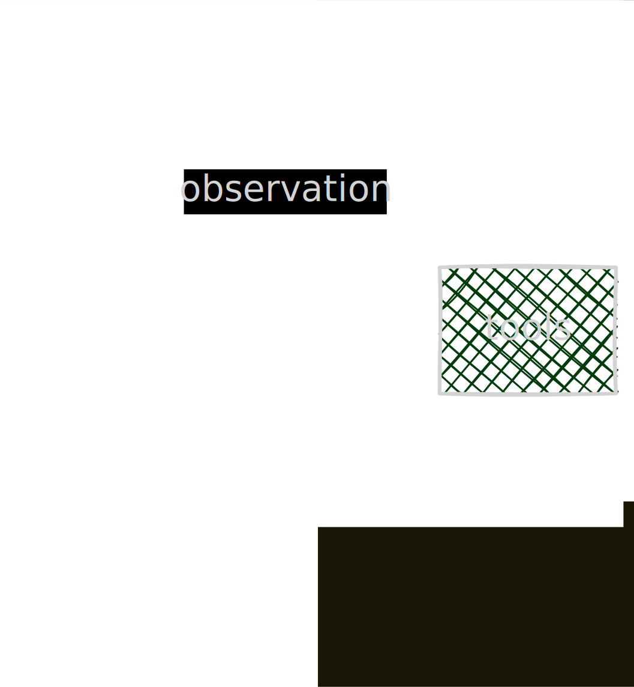

+++
title = "01.使用tool"
date = "2026-07-07 09:11:53+08:00"
[taxonomies]
tags = ["agent", "tool"]
+++




在使用 tool 装饰工具函数时需提供 doc 注释
```python
# 01.tool_use.py
import random

from langchain.agents import create_agent
from langchain.chat_models import init_chat_model
from langchain.messages import HumanMessage
from langchain.tools import tool

llm = init_chat_model(
    model="qwen3.5:0.8b-mlx",
    model_provider="ollama",
)

@tool
def get_weather(city: str) -> str:
    """获取指定城市的天气"""
    res = random.choices(["晴天", "下雨", "多云"], [80, 15, 5], k=1)[0]
    return city + res

agent = create_agent(
    model=llm,
    tools=[get_weather],
    system_prompt="你是一个天气预报助手",
)

res = agent.invoke({"messages": [HumanMessage("北京的天气怎么样？")]})

for msg in res["messages"]:
    print(f"{msg.type}: {msg.content}")
```

结果

```txt
human: 北京的天气怎么样？
ai: 
tool: 北京晴天
ai: 北京现在的天气是**晴**。
```